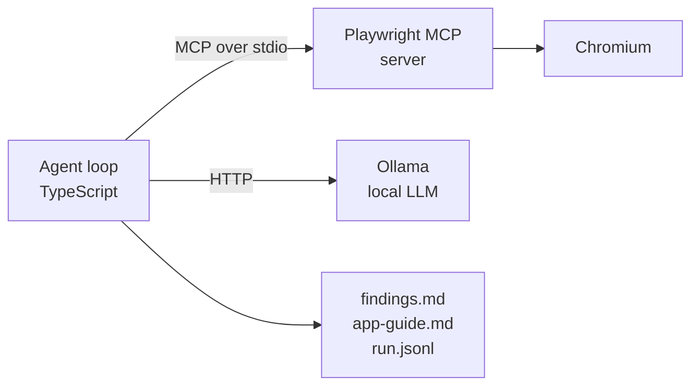

# exploratory-mcp-agent

An autonomous exploratory tester. Point it at a web application, and it works
through it on its own — reading the page, deciding what is worth probing,
poking at edge cases — and then writes up two things:

- **`findings.md`** — defects and risks it actually observed, ranked by severity
- **`app-guide.md`** — how the application works, for someone who has never seen it

Both come out of the same run, because they are the same knowledge. An agent
that has just spent twenty minutes working out what an app does is the wrong
thing to throw away.

## Why it exists

Two problems with how exploratory testing usually works:

1. **The exploration is never written down.** A tester builds an accurate mental
   model of a new application, reports a handful of bugs, and the model dies with
   the session. The next person starts from zero.
2. **Automated checks do not explore.** Scripted tests only confirm what you
   already thought to ask. They are excellent at that and useless at finding the
   thing nobody considered.

This agent sits in the gap: it explores like a person, and it leaves both
artefacts behind.

## How it is put together



The agent is an **MCP client**. The browser lives in a separate process behind the
Model Context Protocol, which keeps the boundary explicit: the model asks for an
action in a documented vocabulary, and nothing in the reasoning layer knows a
selector.

This is the case MCP was actually designed for. From the Playwright MCP README:

> MCP remains relevant for specialized agentic loops that benefit from persistent
> state, rich introspection, and iterative reasoning over page structure, such as
> **exploratory automation**, self-healing tests, or **long-running autonomous
> workflows** where maintaining continuous browser context outweighs token cost
> concerns.

## Quick start

```bash
npm install
node node_modules/playwright/cli.js install chromium
cp .env.example .env          # optional; defaults work
ollama pull qwen2.5:7b
npm start -- --url https://the-internet.herokuapp.com --steps 15
```

Output lands in `runs/<timestamp>/`.

## Measured performance

Numbers below are from one developer machine, because "runs locally" is only
useful if you know what it costs. Qwen2.5 7B, AMD RX 6900 XT via Vulkan:

| | |
|---|---|
| Prompt processing | **271 tokens/s** |
| Generation | **55 tokens/s** |
| One ~1.5k-token observation | ~6 s |
| Full agent step (observe + decide + act) | **~11 s** |
| A 20-step exploration | **~4 minutes** |

That measurement is what drove the design: at 271 tokens/s of prompt processing,
sending screenshots instead of accessibility trees would roughly double every
step. So structure first, pixels only where structure cannot see.

## Design decisions

**The model sees the accessibility tree, not pixels.** Playwright's own guidance
is that the accessibility snapshot is better for acting than a screenshot. It is
more compact, it carries roles and accessible names, and it does not need a vision
model at all.

**Tool schemas are prose, not JSON Schema.** The server exposes around sixty
tools. Handing all of them to a 7B model spends most of the context window on
schemas it will never call, so eleven are curated and described in a few lines
each. The boundary is explicit in `CURATED_TOOLS`.

**`browser_find` over full snapshots.** Searching the page for a known string
returns matching nodes with a little context, which is far cheaper than reading
everything. The prompt tells the model to prefer it when it knows what it is
looking for.

**Notes, not transcript, in the prompt.** Sending the whole history to a small
model every step makes each call slower and the model no more informed. The loop
keeps a bounded list of established facts plus the last observation, so prompt
size stays flat across a long run.

**Findings are deduplicated by content.** Left alone, a small model reports the
same issue repeatedly in different words. Matching on the title is not enough:
one run produced three findings for a single analytics script that fails to
resolve, under the titles "Console errors when interacting with dropdown menu",
"Console errors due to failed resource loading" and "Console errors on dropdown
page". Findings are now compared as bags of significant words, and two that
overlap heavily are treated as one. The threshold is not guessed —
`npm run check:dedupe` holds real reworded duplicates and real distinct defects
and asserts the threshold separates them.

**Artefacts are written even when a run fails.** If the loop dies at step nine,
steps one to eight are still on disk.

## What the harness does for a small model

A 7B model is a mediocre autonomous agent. The interesting engineering is not
pretending otherwise and pushing the reliability into the harness instead. Three
of these were written because a run failed without them:

**A shortlist of real element refs.** Left alone, the model hunts for a target in
a wall of snapshot text and often names a ref that does not exist. Playwright
already told us every actionable element, so `snapshot.ts` extracts them and the
prompt presents a menu. Finding the thing stops being a reasoning problem and
becomes a lookup. Because Playwright returns a fresh snapshot after most actions,
the menu refreshes itself without an extra step.

**Stall detection.** The model will happily take seven identical snapshots of the
same page and call it progress. The loop compares snapshot text: if two
consecutive reads of an unchanged page happen, the observation is replaced with
an instruction to act. Detecting it from the evidence rather than the tool name
matters, because re-snapshotting after a real page change is correct behaviour and
would be caught by a naive "no repeats" rule.

**It is told where it is.** The model cannot see the address bar, so it guesses -
and guesses are relative paths like `/login`, which fail and burn a step. The
current URL is parsed out of each snapshot and put in front of it, and the prompt
says plainly that `browser_navigate` needs a complete URL.

**A hard budget on the console.** Reading the console is nearly free, which is
exactly why it is a trap: the same page reports the same error every time. One run
spent four of fifteen steps re-reading a single analytics failure. A prompt rule
asking it not to was not enough — the same way a prompt rule about dropdowns was
not enough — so the loop tracks which pages have been checked and refuses the
second read with a correction. Prompts persuade; the harness enforces.

**A nudge when it tunnels.** Left alone, the model picks one page and stays there.
A run with fifteen steps available spent all fourteen on a single A/B testing page
of a twelve-page application, then declared itself finished. The prompt asked it to
widen after exploring deeply and it did not, so the loop counts the distinct pages
reached and, if that number is still one after five steps, tells it plainly to go
back and open something else.

**It is shown the tab list.** The sharpest failure in this project's history is a
false positive the agent reported at high severity, twice: *"Link to Elemental
Selenium does not navigate"*. The link was fine. It opens in a new tab, and a new
tab leaves the current page exactly as it was - which is indistinguishable from a
dead link if all you look at is the current page. The proof was in the same tool
result the whole time:

```
### Open tabs
- 0: (current) [The Internet](https://the-internet.herokuapp.com/abtest)
- 1: [Home | Elemental Selenium](https://elementalselenium.com/)
```

The model had the evidence and did not read it. So the loop reads it, and puts it
where the model cannot miss it, along with the sentence that makes it usable: a
new tab is not a broken link. `npm run check:tabs` pins the parser to that literal
tool output, because a regex that quietly stops matching brings the false positive
back and nothing else would notice.

**Relative navigation is resolved, not rejected.** The prompt states in plain words
that `browser_navigate` needs a complete URL and that a bare path fails. A run sent
`"/abtest"` anyway. Playwright dutifully went looking for `https://abtest/`, DNS
failed, and the agent reported the resulting error page as a high-severity defect in
the application. A relative target is now resolved against the current page before
the tool is called, which is what a browser would have done with it anyway.

**A failed tool call is never a finding.** A tool error is a mistake in the
instruction or a bad day on the machine, and the model cannot tell the difference.
One malformed URL became three separate high-severity "findings" about an
application that was working fine. Findings produced on a failed step are dropped,
and the model is told, in the observation, why they cannot be findings.

**The pattern is worth stating plainly.** Three rules in that prompt have now been
ignored in a way I could measure: use absolute URLs, use `browser_select_option` for
dropdowns, and widen your exploration when you have been on one page for a while.
Every one of them ended up enforced in code instead. A prompt is how you explain
intent to a model; it is not how you make it behave.

**Coverage is recorded, and an empty report says so.** A thorough clean run and a
lazy one both produce a findings file with nothing in it, and that ambiguity is the
most misleading thing this tool can emit. Pages reached are harvested from tool
results - from what the browser actually loaded, not from the model's account of
where it went - and the empty case now reads "No defects were observed in this run"
next to the list of pages that were reached, followed by "Pages that were never
opened are not evidence of health".

Plus the quieter ones: a curated tool surface, notes rather than the full
transcript, findings deduplicated by content, and artefacts written even when the
run dies partway through.

## Limitations, stated plainly

- **It explores; it does not verify.** `findings.md` is a list of leads to
  reproduce, not confirmed defects. The header of the file says so.
- **Small models plan badly over long horizons.** Which is why steps are short,
  the observation window is small, and the loop rejects actions that reference
  tools that do not exist rather than letting the run drift.
- **No authentication.** Public applications only, for now.
- **One tab.** The session is deliberately isolated per run.
- **The guide is only as good as the run.** It describes what was touched, and it
  says nothing about what was not.

## Layout

```
src/
  index.ts          CLI, pre-flight checks
  config.ts         settings and defaults
  llm/ollama.ts     chat client, timings, JSON-constrained output
  mcp/playwright.ts MCP client, curated tool surface
  agent/
    loop.ts         observe -> reason -> act -> record
    prompts.ts      explorer persona and the per-step contract
    artifacts.ts    findings.md, app-guide.md, run.jsonl
  util/log.ts       ASCII-only console output
tools/
  check-finding-dedupe.ts  threshold calibration for finding de-duplication
  check-tabs.ts            open-tab parser, pinned to a real tool result
```

## What is not built yet

- **A verification pass.** The model sometimes states things it did not confirm -
  a run described a page as having "two dropdown menus" when it had one. Every
  claim in `learned` is currently taken at face value. Re-checking each one
  before it reaches the guide would be the single biggest gain in trustworthiness.
- **Promote discoveries into tests.** `browser_generate_locator` already returns a
  real Playwright locator for any element the agent found. Turning stable
  journeys into committed regression specs is the natural next step and the most
  valuable one.
- **Vision pass.** A second, optional sweep for what the accessibility tree
  cannot see: overlap, contrast, broken layout.
- **Coverage is counted, not judged.** The guide lists which pages were reached, so
  a thin run is visible. It does not yet record which controls were exercised or
  which routes were never linked to, so "we saw six of twelve pages" is available
  but "we never touched the search field" is not.
- **Run-to-run diffing.** Two runs against the same app should highlight what
  changed, which is most of the value of running this on a schedule.
