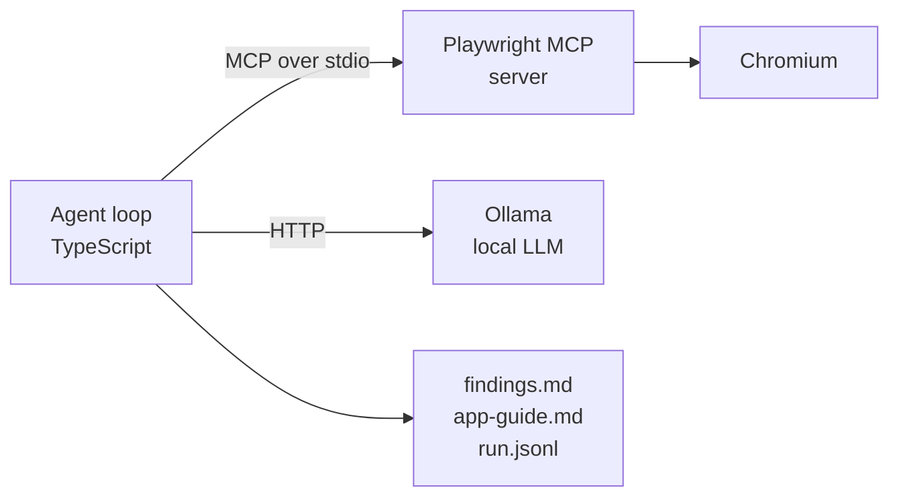

# exploratory-mcp-agent

An autonomous exploratory tester. Point it at a web application, and it works
through it on its own — reading the page, deciding what is worth probing,
poking at edge cases — and then writes up two things:

- **`findings.md`** — defects and risks it actually observed, ranked by severity
- **`app-guide.md`** — how the application works, for someone who has never seen it

Both come out of the same run, because they are the same knowledge. An agent that
has just spent a run working out what an application does is the wrong thing to
throw away.

A complete run is committed under [`examples/`](examples/) - the real, unedited
output of one exploration - if you would rather read what the agent produces before
installing anything.

## Why it exists

Two problems with how exploratory testing usually works:

1. **The exploration is never written down.** A tester builds an accurate mental
   model of a new application, reports a handful of bugs, and the model dies with
   the session. The next person starts from zero.
2. **Automated checks do not explore.** Scripted tests only confirm what you
   already thought to ask. They are excellent at that and useless at finding the
   thing nobody considered.

This agent sits in the gap: it explores like a person, and it leaves both
artefacts behind.

## How it is put together



The agent is an **MCP client**. The browser lives in a separate process behind the
Model Context Protocol, which keeps the boundary explicit: the model asks for an
action in a documented vocabulary, and nothing in the reasoning layer knows a
selector.

This is the case MCP was actually designed for. From the Playwright MCP README:

> MCP remains relevant for specialized agentic loops that benefit from persistent
> state, rich introspection, and iterative reasoning over page structure, such as
> **exploratory automation**, self-healing tests, or **long-running autonomous
> workflows** where maintaining continuous browser context outweighs token cost
> concerns.

## Quick start

```bash
npm install
node node_modules/playwright/cli.js install chromium
cp .env.example .env          # optional; defaults work
ollama pull qwen2.5:14b       # or qwen2.5:7b, which is the default
npm start -- --url https://the-internet.herokuapp.com --steps 15 --model qwen2.5:14b
```

Output lands in `runs/<timestamp>/`. `npm test` runs the typecheck and the
calibration checks described further down.

Be patient with the first step. The model has to be loaded into memory before
anything happens, so expect 20 to 50 seconds of silence, and the loop prints a step
only once that step's tool call has returned. A run is roughly two minutes after
that. I have twice mistaken a perfectly healthy run for a hung one during that
pause, which is usually a good sign that something should be said about it here.

If you only run one model, run the 14B: it reasons noticeably better about what is
worth probing. Do read the timings below before assuming that costs you time.

## Measured performance

Numbers from one developer machine, because "runs locally" is only useful if you
know what it costs. AMD RX 6900 XT via Vulkan.

**Qwen2.5 7B, measured in isolation:** 271 tokens/s prompt processing and 55
tokens/s generation, which puts a ~1.5k-token observation at about 6 seconds and a
full step at about 11.

**Qwen2.5 14B, measured end to end:** a 15-step exploration of a public practice
site used 31,557 prompt tokens, 1,610 output tokens, and 84 seconds of model time.
The first step took ~19 seconds because it loads the weights; after that, steps
ranged from 3 to 9 seconds.

That spread is larger than it looks, and it raises the obvious question of whether
the bigger model is actually the more expensive one to run. The honest answer is
that I do not know yet: those two numbers were produced in different ways - one is
throughput measured on a benchmark, the other is a whole run measured end to end -
so putting them side by side implies a comparison I have not made. Measuring both
models on the same run is the obvious next thing to do here.

What the numbers did decide is the observation format: at 271 tokens/s of prompt
processing, sending screenshots instead of accessibility trees would mean paying
for an image's worth of tokens on every single step. So structure first, pixels
only where structure cannot see.

## Design decisions

**The model sees the accessibility tree, not pixels.** Playwright's own guidance
is that the accessibility snapshot is better for acting than a screenshot. It is
more compact, it carries roles and accessible names, and it does not need a vision
model at all.

**Tool schemas are prose, not JSON Schema.** The server exposes around sixty
tools. Handing all of them to a small model spends most of the context window on
schemas it will never call, so eleven are curated and described in a few lines
each. The boundary is explicit in `CURATED_TOOLS`.

**`browser_find` over full snapshots.** Searching the page for a known string
returns matching nodes with a little context, which is far cheaper than reading
everything. The prompt tells the model to prefer it when it knows what it is
looking for.

**Notes, not transcript, in the prompt.** Sending the whole history to a small
model every step makes each call slower and the model no more informed. The loop
keeps a bounded list of established facts plus the last observation, so prompt
size stays flat across a long run.

**Findings are deduplicated by content.** Left alone, a small model reports the
same issue repeatedly in different words. Matching on the title is not enough:
one run produced three findings for a single analytics script that fails to
resolve, under the titles "Console errors when interacting with dropdown menu",
"Console errors due to failed resource loading" and "Console errors on dropdown
page". Findings are now compared as bags of significant words, and two that
overlap heavily are treated as one. The threshold is not guessed —
`npm run check:dedupe` holds real reworded duplicates and real distinct defects
and asserts the threshold separates them.

**Artefacts are written even when a run fails.** If the loop dies at step nine,
steps one to eight are still on disk.

## What the harness does for a small model

A 7B model is a mediocre autonomous agent. The interesting engineering is not
pretending otherwise - it is moving the reliability out of the prompt and into the
harness.

Every item below exists because a specific run failed in a specific way, and the
failure is named in the code comment above it. Most of them are responses to the same
lesson, which took me most of a day to accept:

> Prompt rules have failed here, measurably, over and over: use absolute URLs, use
> `browser_select_option` for dropdowns, widen your exploration after a while, write
> observations rather than plans. Every one of them ended up enforced in code
> instead. A prompt is how you explain intent to a model; it is not how you make it
> behave.

**A shortlist of real element refs.** Left alone, the model hunts for a target in
a wall of snapshot text and often names a ref that does not exist. Playwright
already told us every actionable element, so `snapshot.ts` extracts them and the
prompt presents a menu. Finding the thing stops being a reasoning problem and
becomes a lookup. Because Playwright returns a fresh snapshot after most actions,
the menu refreshes itself without an extra step.

**Stall detection.** The model will happily take seven identical snapshots of the
same page and call it progress. The loop compares snapshot text: if two
consecutive reads of an unchanged page happen, the observation is replaced with
an instruction to act. Detecting it from the evidence rather than the tool name
matters, because re-snapshotting after a real page change is correct behaviour and
would be caught by a naive "no repeats" rule.

**It is told where it is.** The model cannot see the address bar, so it guesses -
and guesses are relative paths like `/login`, which fail and burn a step. The
current URL is parsed out of each snapshot and put in front of it. That alone was
not enough to stop the guessing; see the navigation item below.

**A hard budget on the console.** Reading the console is nearly free, which is
exactly why it is a trap: the same page reports the same error every time. One run
spent four of fifteen steps re-reading a single analytics failure. A prompt rule
asking it not to was not enough — the same way a prompt rule about dropdowns was
not enough — so the loop tracks which pages have been checked and refuses the
second read with a correction. Prompts persuade; the harness enforces.

**A nudge when it tunnels.** Left alone, the model picks one page and stays there.
A run with fifteen steps available spent all fourteen on a single A/B testing page
of a twelve-page application, then declared itself finished. The prompt asked it to
widen after exploring deeply and it did not, so the loop counts the distinct pages
reached and, if that number is still one after five steps, tells it plainly to go
back and open something else.

**It is shown the tab list.** The sharpest failure in this project's history is a
false positive the agent reported at high severity, twice: *"Link to Elemental
Selenium does not navigate"*. The link was fine. It opens in a new tab, and a new
tab leaves the current page exactly as it was - which is indistinguishable from a
dead link if all you look at is the current page. The proof was in the same tool
result the whole time:

```
### Open tabs
- 0: (current) [The Internet](https://the-internet.herokuapp.com/abtest)
- 1: [Home | Elemental Selenium](https://elementalselenium.com/)
```

The model had the evidence and did not read it. So the loop reads it, and puts it
where the model cannot miss it, along with the sentence that makes it usable: a
new tab is not a broken link. `npm run check:tabs` pins the parser to that literal
tool output, because a regex that quietly stops matching brings the false positive
back and nothing else would notice.

**Relative navigation is resolved, not rejected.** The prompt states in plain words
that `browser_navigate` needs a complete URL and that a bare path fails. A run sent
`"/abtest"` anyway. Playwright dutifully went looking for `https://abtest/`, DNS
failed, and the agent reported the resulting error page as a high-severity defect in
the application. A relative target is now resolved against the current page before
the tool is called, which is what a browser would have done with it anyway.

**A failed tool call is never a finding.** A tool error is a mistake in the
instruction or a bad day on the machine, and the model cannot tell the difference.
One malformed URL became three separate high-severity "findings" about an
application that was working fine. Findings produced on a failed step are dropped,
and the model is told, in the observation, why they cannot be findings.

**A note that names something the browser never showed is not kept.** The
`learned` field is the only source for `app-guide.md`, so an invention in it does
not stay in a chat log - it is written into documentation a colleague is meant to
trust. And it does invent. A run claimed the A/B testing page "contains a button
labeled 'Toggle'", twice. That page contains no `<button>` and no `<input>` element
at all, and the string "toggle" appears nowhere in its 1,850 bytes of HTML.
Checking took one HTTP request and a regex.

Naming an element means quoting its name, and a quoted name either appears in what
the browser returned or it does not, so the loop checks and drops the note, then
tells the model why. On its first run this caught a second invention - 'Version A'
and 'Version B' - and the model withdrew the claim on the following step.
Then a later run walked straight through the gap I had left. The same page grew "a
button to refresh the page" - unquoted, so nothing was checked, and it went into the
guide. That page has no buttons at all, and the word "refresh" appears nowhere on
it. The quoted case had never been protected by the check being clever; it was
protected by "toggle" being a rare enough string that its absence proved something.
"Button" is ordinary English that a model reaches for when it is filling a gap, so
its absence proves something too - as long as the claim is looked at.

Control words are now checked against the roles in the accessibility tree: a claim
saying "a button" when no button has appeared in the run is not describing something
observed. The word list is deliberately short and holds only words that mean one
thing, because a check that guesses wrong makes false accusations, and a false
accusation is worse than a miss. `npm run check:evidence` holds both mechanisms,
including the unquoted claim that got through and the synonym that would otherwise
produce a false alarm: "dropdown" has to be accepted where the tree says
`combobox`.
**It is kept on the application.** The prompt says not to follow links to other
hosts. A run followed one anyway - through a tab - and spent the rest of its budget
on the vendor's website, describing it as though it were the application. Pages
outside the application's own host are now excluded from coverage, and the model is
told plainly that what it finds out there belongs in neither artefact.

That one was self-inflicted, and it is the most useful thing in this file. The tab
awareness added two sections earlier was written to stop false "broken link"
reports, and it did - by pointing the model at the other tab. Fixing one failure
mode created a new one, and the only reason I know is that every run is read rather
than trusted.

**A plan is not an observation.** Half of the `learned` entries in the committed
example are the agent narrating its own intentions - "Navigating back to the homepage
to explore another link", "The homepage contains a link to 'Checkboxes' which I am
about to click". None of that tells a reader anything about the application, and it
is the only content of `app-guide.md`, so the guide reads like a transcript of
somebody thinking out loud.

Most of those claims are not worthless, though: the second one contains a real
observation wrapped in a plan. So the plan is cut off rather than the note thrown
away.

```
"The homepage contains a link to 'Checkboxes' which I am about to click."
  -> "The homepage contains a link to 'Checkboxes'."
```

A claim that opens with the agent's own action - "Navigating back to..." - has no
observation in it at all, so it is dropped and the model is told where that sentence
belongs instead: in `thought`. The original wording stays in `run.jsonl`, because the
transcript is evidence and is not rewritten. Only the guide is cleaned.

**Coverage is reported in every run.** A thorough clean run and a lazy one both
produce a findings file with nothing in it, and that ambiguity is the most misleading
thing this tool can emit. So every report ends with the pages that were reached,
gathered from what the browser actually loaded rather than from the model's account of
where it went, next to the line that stops it being read as a clean bill of health:
*Pages that were never opened are not evidence of health.*

It matters more when there **are** findings, not less - three defects found after
reaching one page is a very different report from the same three after reaching
twenty. The first version of this printed coverage only when the findings list was
empty, which is precisely backwards, and it took seeing a one-finding report to
notice.

Plus the quieter ones: a curated tool surface, notes rather than the full
transcript, findings deduplicated by content, and artefacts written even when the
run dies partway through.

## Limitations, stated plainly

- **It explores; it does not verify.** `findings.md` is a list of leads to
  reproduce, not confirmed defects. The header of the file says so. Notes are
  checked for invented element names; they are not checked for accuracy.
- **Small models plan badly over long horizons.** Which is why steps are short,
  the observation window is small, and the loop rejects actions that reference
  tools that do not exist rather than letting the run drift.
- **No authentication.** Public applications only, for now.
- **Native browser UI is invisible to it.** The accessibility tree contains the page,
  not the browser. A context menu, a file picker or a native alert is not in it, so an
  interaction that only produces native UI looks exactly like an interaction that does
  nothing - and the agent will report it as one. The committed example run does
  precisely this: it calls the Context Menu page broken because right-clicking
  produced no visible change, when in fact the menu belongs to the browser and was
  never going to appear in a snapshot. The finding is honest about what was observed
  and still wrong about the application, which is the distinction the whole
  limitations section is about.
- **Tabs are noticed, not explored.** The loop reads the tab list, so a link that
  opens in a new tab is not mistaken for a dead one, but the agent works in one tab
  at a time.
- **The guide is only as good as the run.** It describes what was touched, and it
  says nothing about what was not.

## Layout

```
src/
  index.ts          CLI, pre-flight checks
  config.ts         settings and defaults
  llm/ollama.ts     chat client, timings, JSON-constrained output
  mcp/playwright.ts MCP client, curated tool surface
  agent/
    loop.ts         observe -> reason -> act -> record
    prompts.ts      explorer persona and the per-step contract
    artifacts.ts    findings.md, app-guide.md, run.jsonl
    snapshot.ts     real element refs, harvested from the accessibility tree
    evidence.ts     checks a claim against what the browser actually returned
    notes.ts        strips a plan out of a note, keeping the observation
  util/log.ts       ASCII-only console output
tools/
  check-tabs.ts            open-tab parser, pinned to a real tool result
  check-finding-dedupe.ts  threshold calibration for finding de-duplication
  check-offsite.ts         which URLs count as the application
  check-notes.ts           note trimming, against real sentences from a run
  check-evidence.ts        claim checking, quoted names and bare control words
examples/
  the-internet/            one complete run, kept so the output can be read
                           without running anything
```

## Checks

`npm test` runs the typecheck and three small calibration checks. They are not unit
tests for their own sake - each one pins a decision that a run got wrong, so that a
later change cannot quietly bring the failure back.

| Check | What it pins |
|---|---|
| `check:tabs` | the open-tab parser, against the literal tool output behind a false "broken link" finding |
| `check:dedupe` | the similarity threshold, between real reworded duplicates and real distinct defects |
| `check:offsite` | which URLs count as the application, lookalike hosts included |
| `check:notes` | note trimming, against nine real sentences from the committed run |
| `check:evidence` | claim checking, including the unquoted invention that got through |

The de-duplication threshold is the clearest example of why these exist. Reworded
reports of one issue measured 0.50 similarity, genuinely different defects measured
at most 0.14, and the threshold sits between the two groups instead of on the edge
of one. A number that is only in someone's head is a number the next person will
change by accident.

## What is not built yet

- **The note trimmer matches patterns, it does not understand.** It knows the
  phrasings this model has actually used, and a new way of narrating the same plan
  will get through. `npm run check:notes` holds nine real sentences from the
  committed run - including three that straddle the line between an observation and
  a plan - and is where a new phrasing will first show up as a failure.
- **The model invents element refs when the shortlist is empty.** After a navigation,
  Playwright sometimes returns the snapshot as a file link rather than inline, so
  there are no refs to hand over and the model fills the gap. The committed example
  does it twice - it asks to click `e2` and `e12`, both of which fail - and loses two
  of its fourteen steps to it. The prompt says not to invent a ref; that sentence
  should by now be read as a description of a bug rather than a rule. The fix is the
  same shape as the others: reject a click or a type whose target is not in the
  current shortlist, and ask for a snapshot first.
- **A full verification pass.** The control check described above catches a control
  that was invented outright, quoted or not. It does not catch a claim that is
  subtly wrong: a count that is off, a flow described backwards, behaviour that does
  not match what the page really does, or a control named with the wrong role. One
  run described the A/B testing page as displaying "two versions of a paragraph"
  when it displays one paragraph explaining what A/B testing is, and no check here
  would have noticed. Closing that gap means re-deriving each claim from the
  evidence rather than checking whether its nouns appear, and it is still the single
  biggest gain in trustworthiness available.
- **Promote discoveries into tests.** `browser_generate_locator` already returns a
  real Playwright locator for any element the agent found. Turning stable
  journeys into committed regression specs is the natural next step and the most
  valuable one.
- **Vision pass.** A second, optional sweep for what the accessibility tree
  cannot see: overlap, contrast, broken layout.
- **Coverage is counted, not judged.** The guide lists which pages were reached, so
  a thin run is visible. It does not yet record which controls were exercised or
  which routes were never linked to, so "we saw six of twelve pages" is available
  but "we never touched the search field" is not.
- **Run-to-run diffing.** Two runs against the same app should highlight what
  changed, which is most of the value of running this on a schedule.
